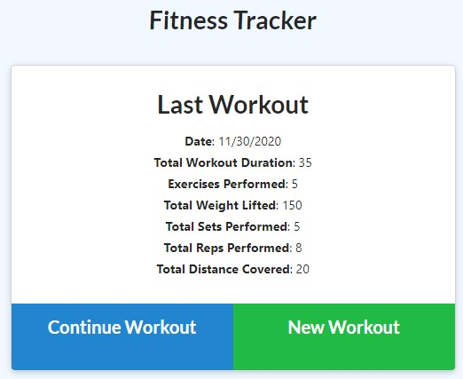

# Note Taker

## Description
This is an application that lets you track your exercise progress across different workouts over time.

## Table of Contents
* [Installation](#Installation)
* [Application use](#Usage)
* [Contribution Guidelines](#Contribution)
* [Tests](#Tests)
* [License](#License)
* [Questions](#Questions)

## Installation
This is deployed web application, so no installation is required. Check it out at Demo of the app: https://dry-stream-50151.herokuapp.com/

## Usage
Click "New Workout" to start your workout. After completing each exercise (resistance or cardio) click "Continue Workout" to add the exercise to the workout. When you return to the gym, you'll be greeted with the last workout you completed so you can try to improve a little each day!

Homepage: 
 
Add exercises: 
 
Exercise details: 
 

## Contribution
Submit bug and feature requests as issues through the GitHub repo.

## Tests
None

## License
This app can be used under the terms of the MIT license.

## Questions
For questions, please contact <cmetzjr@yahoo.com>. 
GitHub repo: https://github.com/cmetzjr/workout-tracker
